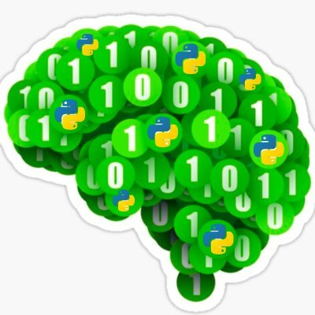

	

 

# Pythoneuro
The list of great Python packages I have posted on [my twitter account](https://twitter.com/pythoneuro) is continually being updated.

My goal is to promote python as the leading language for coding and analyzing in the neuroscience field! 🧠🧑‍🎓👩‍💻
I also love and support open science ❤️

If you're working on a cool neuroscience Python project, feel free to add yourself through a pull request/tag me or contact me on Twitter.

## Repositories
- [MNE](https://github.com/mne-tools/mne-python)- Exploring, visualizing, and analyzing human neurophysiological data such as MEG, EEG, sEEG, ECoG, and more.
- [Visbrain](https://github.com/EtienneCmb/visbrain)- Brain signals visualization.
- [Dipy](https://github.com/dipy/dipy)- Analysis of MR diffusion imaging.
- [Brainrender](https://github.com/brainglobe/brainrender)- Visualization of three dimensional neuro-anatomical data.
- [Neo](https://github.com/NeuralEnsemble/python-neo)- A package for working with electrophysiology data in Python, with support for reading a wide range of neurophysiology file formats.
- [Brian2](https://github.com/brian-team/brian2)- A clock-driven simulator for spiking neural networks.
- [Neurolib](https://github.com/neurolib-dev/neurolib)- A simulation and optimization framework for whole-brain modeling
- [Cellfinder](https://github.com/brainglobe/cellfinder)- Analysis of whole-brain imaging data
- [BluePyOpt](https://github.com/BlueBrain/BluePyOpt)- A framework for data-driven model parameter optimization that wraps and standardizes several existing open-source tools.
- [Neuro-Nav](https://github.com/awjuliani/neuro-nav)- A library for neurally plausible reinforcement learning (RL).
- [Pycortex](https://github.com/gallantlab/pycortex)- Visualize fMRI or other volumetric neuroimaging data on cortical surfaces.
- [yyRiemann](https://github.com/pyRiemann/pyRiemann)- A high-level interface for classifying and manipulating multivariate biosignals through Riemannian Geometry of covariance matrices.
- [Pynapple](https://github.com/PeyracheLab/pynapple)- Handle all sorts of physiological and behavioral data.
- [Pynacollada](https://github.com/PeyracheLab/pynacollada)- Collaborative platform for high-level analysis with pynapple.

## Other useful links
- [Case Studies in Neural Data Analysis](https://mark-kramer.github.io/Case-Studies-Python/intro.html)- Python for the practicing neuroscientist: an online educational resource.
- [OpenNeuro](https://openneuro.org/)- A free and open platform for analyzing and sharing neuroimaging data.
- [Matlab vs python](https://realpython.com/matlab-vs-python)- Why and how to make the switch
- [Spikes and Bursts](https://spikesandbursts.wordpress.com/patch-clamp/)- A blog with tutorials on patch-clamp (and more methods) data analysis in python.

---

Thanks for visiting!
If you like it you can follow me and star this repo :)
